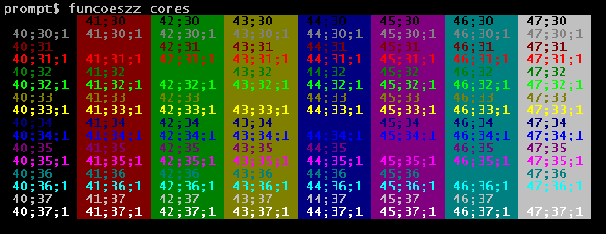

# Shell-Script

<br>

### Fonte:  <https://aurelio.net/shell/canivete/>

<br>

## Canivete Suíço do Shell (Bash)

# 1. Operadores

<table>
    <tr>
        <th colspan="2">Operadores Aritméticos</th>
    </tr>
    <tr>
        <td>+</td>
        <td>Adição</td>
    </tr>
    <tr>
        <td>-</td>
        <td>Subtração</td>
    </tr> 
    <tr>
        <td>*</td>
        <td>Multiplicação</td>
    </tr>
    <tr>
        <td>/</td>
        <td>Divisão</td>
    </tr>
    <tr>
        <td>%</td>
        <td>Módulo</td>
    </tr>
    <tr>
        <td>* *</td>
        <td>Exponenciação</td>
    </tr>
</table>
<br>

<table>
    <tr>
        <th colspan="2">Operadores de Atribuição</th>
    </tr>
    <tr>
        <td>=</td>
        <td>Atribui valor a uma variável</td>
    </tr>
    <tr>
        <td>+ =</td>
        <td>Incrementa a variável por uma constante</td>
    </tr> 
    <tr>
        <td>- =</td>
        <td>Decrementa a variável por uma constante</td>
    </tr>
    <tr>
        <td>* =</td>
        <td>Multiplica a variável por uma constante</td>
    </tr>
    <tr>
        <td>/ =</td>
        <td>Divide a variável por uma constante</td>
    </tr>
    <tr>
        <td>% =</td>
        <td>Resto da divisão por uma constante</td>
    </tr>
        <tr>
        <td>+ +</td>
        <td>Incrementa em 1 o valor da variável</td>
    </tr> 
    <tr>
        <td>- -</td>
        <td>Decrementa em 1 o valor da variável</td>
    </tr>
</table>

<br>

<table>
    <tr>
        <th colspan="2">Operadores Relacionais</th>
    </tr>
    <tr>
        <td>= =</td>
        <td>Igual</td>
    </tr>
    <tr>
        <td>! =</td>
        <td>Diferente</td>
    </tr> 
    <tr>
        <td>></td>
        <td>Maior</td>
    </tr>
    <tr>
        <td>> =</td>
        <td>Maior ou Igual</td>
    </tr>
    <tr>
        <td><</td>
        <td>Menor</td>
    </tr>
     <tr>
        <td>< =</td>
        <td>Menor ou Igual</td>
    </tr>
</table>
<br>

<table>
    <tr>
        <th colspan="2">Operadores Lógicos</th>
    </tr>
    <tr>
        <td>& &</td>
        <td>E lógico (AND)</td>
    </tr>
    <tr>
        <td>| |</td>
        <td>OU lógico (OR)</td>
    </tr> 
</table>
<br>

<table>
    <tr>
        <th colspan="2">Operadores de BIT</th>
    </tr>
    <tr>
        <td><<=</td>
        <td>Deslocamento à esquerda</td>
    </tr>
    <tr>
        <td>>>=</td>
        <td>Deslocamento à direita</td>
    </tr> 
    <tr>
        <td>&=</td>
        <td>E de bit</td>
    </tr>
     <tr>
        <td>|=</td>
        <td>OU de bit</td>
    </tr>
    <tr>
        <td>^=</td>
        <td>OU exclusivo de bit</td>
    </tr>
</table>
<br>

# 2. Redirecionamento

<table>
    <tr>
        <th>Operador</th>
        <th>Ação</th>
    </tr>
    <tr>
        <td><</td>
        <td>Redireciona a entrada padrão (STDIN)</td>
    </tr>
    <tr>
        <td>></td>
        <td>Redireciona a saída padrão (STDOUT)</td>
    </tr> 
    <tr>
        <td>2></td>
        <td>Redireciona a saída de erro (STDERR)</td>
    </tr>
    <tr>
        <td>>></td>
        <td>Redireciona a saída padrão, anexando</td>
    </tr>
    <tr>
        <td>2>></td>
        <td>Redireciona a saída de erro, anexando</td>
    </tr>
    <tr>
        <td>|</td>
        <td>Conecta a saída padrão com a entrada padrão de outro comando</td>
    </tr> 
    <tr>
        <td>2>&1</td>
        <td>Conecta a saída de erro na saída padrão</td>
    </tr>
    <tr>
        <td>>&2</td>
        <td>Conecta a saída padrão na saída de erro</td>
    </tr>
    <tr>
        <td>>&-</td>
        <td>Fecha a saída padrão</td>
    </tr>
    <tr>
        <td>2>&-</td>
        <td>Fecha a saída de erro</td>
    </tr> 
    <tr>
        <td>3<>arq</td>
        <td>Conecta o descritor de arquivos 3 ao arquivo 'arq'</td>
    </tr>
    <tr>
        <td><< FIM</td>
        <td>Alimenta a entrada padrão (Here Document)</td>
    </tr>
    <tr>
        <td><<-FIM</td>
        <td>Alimenta a entrada padrão, cortando TABs</td>
    </tr>
    <tr>
        <td><(cmd)</td>
        <td>A saída do comando 'cmd' é um arquivo: diff <(cmd1) <(cmd2)</td>
    </tr>
    <tr>
        <td>>(cmd)</td>
        <td>A entrada do comando 'cmd' é um arquivo: tar cf >(bzip2 -c >file.tbz) $dir</td>
    </tr>
</table>
<br>

# 3. Variáveis especiais

<table>
    <tr>
        <th>Variável</th>
        <th>Parâmetros Posicionais</th>
    </tr>
    <tr>
        <td>$0</td>
        <td>Parâmetro número 0 (nome do comando ou função)</td>
    </tr>
    <tr>
        <td>$1</td>
        <td>Parâmetro número 1 (da linha de comando ou função)</td>
    </tr> 
    <tr>
        <td>...</td>
        <td>Parâmetro número N ...</td>
    </tr>
    <tr>
        <td>$9</td>
        <td>Parâmetro número 9 (da linha de comando ou função)</td>
    </tr>
    <tr>
        <td>${10}</td>
        <td>Parâmetro número 10 (da linha de comando ou função)</td>
    </tr>
    <tr>
        <td>...</td>
        <td>Parâmetro número NN ...</td>
    </tr> 
    <tr>
        <td>$#</td>
        <td>Número total de parâmetros da linha de comando ou função</td>
    </tr>
    <tr>
        <td>$*</td>
        <td>Todos os parâmetros, como uma string única</td>
    </tr> 
    <tr>
        <td>$@</td>
        <td>Todos os parâmetros, como várias strings protegidas</td>
    </tr>
    <tr>
        <th>Variável</th>
        <th>Miscelânia</th>
    </tr>
    <tr>
        <td>$$</td>
        <td>Conecta a saída padrão na saída de erro</td>
    </tr>
       <tr>
        <td>$!</td>
        <td>Fecha a saída padrão</td>
    </tr>
         <tr>
        <td>$_</td>
        <td>Fecha a saída de erro</td>
    </tr> 
    <tr>
        <td>$?</td>
        <td>Conecta o descritor de arquivos 3 ao arquivo 'arq'</td>
    </tr>
</table>
<br>

# 4. Expansão de variáveis

<table>
    <tr>
        <th>Sintaxe</th>
        <th>Expansão Condicional</th>
    </tr>
    <tr>
        <td>${var:-texto}</td>
        <td>Se var não está definida, retorna 'texto'</td>
    </tr>
    <tr>
        <td>${var:=texto}</td>
        <td>Se var não está definida, defina-a com 'texto'</td>
    </tr> 
    <tr>
        <td>${var:?texto}</td>
        <td>Se var não está definida, retorna o erro 'texto'</td>
    </tr>
    <tr>
        <td>${var:+texto}</td>
        <td>Se var está definida, retorna 'texto', senão retorna o vazio</td>
    </tr> 
    <tr>
        <th>Sintaxe</th>
        <th>Expansão de Strings</th>
    </tr>
    <tr>
        <td>${var}</td>
        <td>É o mesmo que $var, porém não ambíguo</td>
    </tr>
    <tr>
        <td>${#var}</td>
        <td>Retorna o tamanho da string</td>
    </tr>
    <tr>
        <td>${!var}</td>
        <td>Executa o conteúdo de $var (igual 'eval \$$var')</td>
    </tr> 
    <tr>
        <td>${!texto*}</td>
        <td>Retorna os nomes de variáveis começadas por 'texto'</td>
    </tr>
    <tr>
        <td>${var:N}</td>
        <td>Retorna o texto a partir da posição 'N'</td>
    </tr>
    <tr>
        <td>${var:N:tam}</td>
        <td>Retorna 'tam' caracteres a partir da posição 'N'</td>
    </tr>
    <tr>
        <td>${var#texto}</td>
        <td>Corta 'texto' do início da string</td>
    </tr> 
    <tr>
        <td>${var##texto}</td>
        <td>Corta 'texto' do início da string (* guloso)</td>
    </tr>
      <tr>
        <td>${var%texto}</td>
        <td>Corta 'texto' do final da string</td>
    </tr>
    <tr>
        <td>${var%%texto}</td>
        <td>Corta 'texto' do final da string (* guloso)</td>
    </tr>
    <tr>
        <td>${var/texto/novo}</td>
        <td>Substitui 'texto' por 'novo', uma vez</td>
    </tr> 
    <tr>
        <td>${var//texto/novo}</td>
        <td>Substitui 'texto' por 'novo', sempre</td>
    </tr>
    <tr>
        <td>${var/#texto/novo}</td>
        <td>Se a string começar com 'texto', substitui 'texto' por 'novo'</td>
    </tr>
    <tr>
        <td>${var/%texto/novo}</td>
        <td>Se a string terminar com 'texto', substitui 'texto' por 'novo'</td>
    </tr>
    <tr>
        <td>${var^}</td>
        <td>Converte para maiúscula o primeiro caractere</td>
    </tr> 
    <tr>
        <td>${var^^}</td>
        <td>Converte para maiúscula todos os caracteres</td>
    </tr>
    <tr>
        <td>${var,}</td>
        <td>Converte para minúscula o primeiro caractere</td>
    </tr>
    <tr>
        <td>${var,,}</td>
        <td>Converte para minúscula todos os caracteres</td>
    </tr>
    <tr>
        <td>${var~}</td>
        <td>Inverte maiúscula/minúscula do primeiro caractere</td>
    </tr> 
    <tr>
        <td>${var~~}</td>
        <td>Inverte maiúscula/minúscula de todos os caracteres</td>
    </tr>
</table>
<br>

# 5. Blocos e agrupamentos

<table>
    <tr>
        <th>Sintaxe</th>
        <th>Descrição</th>
        <th>Exemplo</th>
    </tr>
    <tr>
        <td>"..."</td>
        <td>Protege uma string, mas reconhece $, \ e ` como especiais</td>
        <td>"abc"</td>
    </tr>
    <tr>
        <td>'...'</td>
        <td>Protege uma string completamente (nenhum caractere é especial)</td>
        <td>'abc'</td>
    </tr> 
    <tr>
        <td>$'...'</td>
        <td>Protege uma string completamente, mas interpreta \n, \t, \a, etc</td>
        <td>$'abc\n'</td>
    </tr>
    <tr>
        <td>`...`</td>
        <td>Executa comandos numa subshell, retornando o resultado</td>
        <td>`ls`</td>
    </tr>
    <tr>
        <td>{...}</td>
        <td>Agrupa comandos em um bloco</td>
        <td>{ ls ; }</td>
    </tr> 
    <tr>
        <td>(...)</td>
        <td>Executa comandos numa subshell</td>
        <td>( ls )</td>
    </tr>
    <tr>
        <td>$(...)</td>
        <td>Executa comandos numa subshell, retornando o resultado</td>
        <td>$( ls )</td>
    </tr> 
    <tr>
        <td>((...))</td>
        <td>Testa uma operação aritmética, retornando 0 ou 1</td>
        <td>((5 > 3))</td>
    </tr>
    <tr>
        <td>$((...))</td>
        <td>Retorna o resultado de uma operação aritmética</td>
        <td>$((5+3))</td>
    </tr>
    <tr>
        <td>[...]</td>
        <td>Testa uma expressão, retornando 0 ou 1 (alias do comando 'test')</td>
        <td>[ 5 -gt 3 ]</td>
    </tr> 
    <tr>
        <td>[[...]]</td>
        <td>Testa uma expressão, retornando 0 ou 1 (podendo usar && e ||)</td>
        <td>[[ 5 > 3 ]]</td>
    </tr>
</table>
<br>

# 6. if, for, select, while, until, case

## if                 
```bash                       
if COMANDO 
        then
            ...
    elif COMANDO 
        then 
            ... 
    else 
    ...
fi 
```
## for / select                  
```bash                       
for VAR in LISTA
do
    ...
done

ou:

for ((exp1;exp2;exp3))
```
## while / until
```bash
while COMANDO
do
    ...
done
```
## case 
```bash
case $VAR in
    txt1) ... ;;
    txt2) ... ;;
    txtN) ... ;;
    *)    ... ;;
esac
```
<br>

# 7. Opções do comando test ou [

<table>
    <tr>
        <th colspan="2">Comparação Numérica</th>
    </tr>
    <tr>
        <td>-lt</td>
        <td>É menor que (LessThan)</td>
    </tr>
    <tr>
        <td>-gt</td>
        <td>É maior que (GreaterThan)</td>
    </tr>
    <tr>
        <td>-le</td>
        <td>É menor igual (LessEqual)</td>
    </tr>
    <tr>
        <td>-ge</td>
        <td>É maior igual (GreaterEqual)</td>
    </tr>
    <tr>
        <td>-eq</td>
        <td>É igual (EQual)</td>
    </tr> 
    <tr>
        <td>-ne</td>
        <td>É diferente (NotEqual)</td>
    </tr>
    <tr>
        <th colspan="2">Comparação de Strings</th>
    </tr>
    <tr>
        <td>=</td>
        <td>É igual</td>
    </tr> 
    <tr>
        <td>!=</td>
        <td>É diferente</td>
    </tr>
    <tr>
        <td>-n</td>
        <td>É não nula</td>
    </tr>
    <tr>
        <td>-z</td>
        <td>É nula</td>
    </tr>
    <tr>
        <th colspan="2">Operadores Lógicos</th>
    </tr> 
    <tr>
        <td>!</td>
        <td>NÃO lógico (NOT)</td>
    </tr>
    <tr>
        <td>-a</td>
        <td>E lógico (AND)</td>
    </tr>
    <tr>
        <td>-o</td>
        <td>OU lógico (OR)</td>
    </tr>
    <tr>
        <th colspan="2">Testes em arquivos</th>
    </tr>
    <tr>
        <td>-b</td>
        <td>É um dispositivo de bloco</td>
    </tr>
    <tr>
        <td>-c</td>
        <td>É um dispositivo de caractere</td>
    </tr>
    <tr>
        <td>-d</td>
        <td>É um diretório</td>
    </tr>
    <tr>
        <td>-e</td>
        <td>O arquivo existe</td>
    </tr>
    <tr>
        <td>-f</td>
        <td>É um arquivo normal</td>
    </tr>
    <tr>
        <td>-g</td>
        <td>O bit SGID está ativado</td>
    </tr>
    <tr>
        <td>-G</td>
        <td>O grupo do arquivo é o do usuário atual</td>
    </tr>
    <tr>
        <td>-k</td>
        <td>O sticky-bit está ativado</td>
    </tr>
    <tr>
        <td>-L</td>
        <td>O arquivo é um link simbólico</td>
    </tr>
    <tr>
        <td>-O</td>
        <td>O dono do arquivo é o usuário atual</td>
    </tr>
    <tr>
        <td>-p</td>
        <td>O arquivo é um named pipe</td>
    </tr>
    <tr>
        <td>-r</td>
        <td>O arquivo tem permissão de leitura</td>
    </tr>
    <tr>
        <td>-s</td>
        <td>O tamanho do arquivo é maior que zero</td>
    </tr>
    <tr>
        <td>-S</td>
        <td>O arquivo é um socket</td>
    </tr>
    <tr>
        <td>-t</td>
        <td>O descritor de arquivos N é um terminal</td>
    </tr>
    <tr>
        <td>-u</td>
        <td>O bit SUID está ativado</td>
    </tr>
    <tr>
        <td>-w</td>
        <td>O arquivo tem permissão de escrita</td>
    </tr>
    <tr>
        <td>-x</td>
        <td>O arquivo tem permissão de execução</td>
    </tr>
    <tr>
        <td>-nt</td>
        <td>O arquivo é mais recente (NewerThan)</td>
    </tr>
    <tr>
        <td>-ot</td>
        <td>O arquivo é mais antigo (OlderThan)</td>
    </tr>
    <tr>
        <td>-ef</td>
        <td>O arquivo é o mesmo (EqualFile)</td>
    </tr>
</table>
<br>

# 8. Escapes especiais para usar no prompt (PS1)

|Escape |Lembrete   |Expande para...                                           |
|:-----:|:----------|:---------------------------------------------------------|
|\a     |Alerta     |Alerta (bipe)                                             |
|\d 	|Data       |Data no formato "Dia-da-semana Mês Dia" (Sat Jan 15)      |
|\e 	|Escape     |Caractere Esc                                             |
|\h 	|Hostname   |Nome da máquina sem o domínio (dhcp11)                    |
|\H 	|Hostname   |Nome completo da máquina (dhcp11.empresa)                 |
|\j     |Jobs       |Número de jobs ativos                                     |
|\l     |Tty        |Nome do terminal corrente (ttyp1)                         |
|\n     |Newline    |Linha nova                                                |
|\r     |Return 	|Retorno de carro                                          |
|\s 	|Shell 	    |Nome do shell (basename $0)                               |
|\t 	|Time 	    |Horário no formato 24 horas HH:MM:SS                      |
|\T 	|Time 	    |Horário no formato 12 horas HH:MM:SS                      |
|\@ 	|At 	    |Horário no formato 12 horas HH:MM am/pm                   |
|\A 	|At 	    |Horário no formato 24 horas HH:MM                         |
|\u 	|Usuário    |Login do usuário corrente                                 |
|\v 	|Versão 	|Versão do Bash (2.00)                                     |
|\V 	|Versão 	|Versão+subversão do Bash (2.00.0)                         |
|\w 	|Working Dir|Diretório corrente, caminho completo ($PWD)               |
|\W 	|Working Dir|Diretório corrente, somente o último (basename $PWD)      |
|\! 	|Histórico  |Número do comando corrente no histórico                   |
|\# 	|Número 	|Número do comando corrente                                |
|\$ 	|ID 	    |Mostra "#" se for root, "$" se for usuário normal         |
|\nnn 	|Octal 	    |Caractere cujo octal é nnn                                |
|\\ 	|Backslash 	|Barra invertida \ literal                                 |
|\[ 	|Escapes 	|Inicia uma seqüência de escapes (tipo códigos de cores)   |
|\] 	|Escapes 	|Termina uma seqüência de escapes                          |

# 9. Escapes reconhecidos pelo comando echo

|Escape | 	Lembrete|	Descrição                       |
|-------|-----------|-----------------------------------|       
|\a     |Alerta     |Alerta (bipe)                      |
|\b     |Backspace 	|Caractere Backspace                |
|\c	    |EOS 	    |Termina a string                   |
|\e 	|Escape 	|Caractere Esc                      |
|\f 	|Form feed 	|Alimentação                        |
|\n 	|Newline 	|Linha nova                         |
|\r 	|Return 	|Retorno de carro                   |
|\t 	|Tab 	    |Tabulação horizontal               |
|\v 	|Vtab 	    |Tabulação vertical                 |
|\\ 	|Backslash 	|Barra invertida \ literal          |
|\nnn   |Octal 	    |Caractere cujo octal é nnn         |
|\xnn   |Hexa 	    |Caractere cujo hexadecimal é nn    |


# 10. Formatadores do comando date

|Formato| 	Descrição                                   |
|-------|-----------------------------------------------|
|%a 	|Nome do dia da semana abreviado (Dom..Sáb)     |
|%A 	|Nome do dia da semana (Domingo..Sábado)        |
|%b 	|Nome do mês abreviado (Jan..Dez)               |
|%B 	|Nome do mês (Janeiro..Dezembro)                |    
|%c 	|Data completa (Sat Nov 04 12:02:33 EST 1989)   |
|%y 	|Ano (dois dígitos)                             |
|%Y 	|Ano (quatro dígitos)                           |
|%m 	|Mês (01..12)                                   |
|%d 	|Dia (01..31)                                   |
|%j 	|Dia do ano (001..366)                          |
|%H 	|Horas (00..23)                                 |
|%M 	|Minutos (00..59)                               |
|%S 	|Segundos (00..60)                              |
|%s 	|Segundos desde 1º de Janeiro de 1970           |
|%% 	|Um % literal                                   |
|%t 	|Um TAB                                         |
|%n 	|Uma quebra de linha                            |

# 11. Formatadores do comando printf

|Formato| 	Descrição                                   |
|-------|-----------------------------------------------|
|%d 	|Número decimal                                 |
|%o 	|Número octal                                   |
|%x 	|Número hexadecimal (a-f)                       |
|%X 	|Número hexadecimal (A-F)                       |
|%f 	|Número com ponto flutuante                     |
|%e 	|Número em notação científica (e+1)             |
|%E 	|Número em notação científica (E+1)             |
|%s 	|String                                         |

# 12. Letras identificadoras de arquivos no comando ls -l

|Letra 	|Lembrete 	|Tipos de Arquivo (primeiro caractere)                                      |
|-------|-----------|---------------------------------------------------------------------------|      
|-      |-          |Arquivo normal                                                             |
|d      |Directory 	|Diretório                                                                  |
|l      |Link 	    |Link simbólico                                                             |
|b      |Block 	    |Dispositivo de blocos (HD)                                                 |
|c      |Char 	    |Dispositivo de caracteres (modem serial)                                   |
|s      |Socket     |Socket mapeado em arquivo (comunicação de processos)                       |
|p      |Pipe 	    |FIFO ou Named Pipe (comunicação de processos)                              |

|Letra 	|Lembrete 	|Permissões do Arquivo (próximos nove caracteres)                           |
|-------|-----------|---------------------------------------------------------------------------|
|-      |-          |Permissão desativada                                                       |
|r      |Read 	    |Acesso de leitura                                                          |
|w      |Write 	    |Acesso de escrita                                                          |
|x      |eXecute    |Acesso de execução (ou acesso ao diretório)                                |
|X      |eXecute    |Acesso ao diretório somente                                                |        
|s      |Set ID     |Usuário/grupo para execução (SUID, SGID) - permissão 'x' ativada           |
|S      |Set ID     |Usuário/grupo para execução (SUID, SGID) - permissão 'x' desativada        |
|t      |sTicky     |Usuários só apagam seus próprios arquivos - permissão 'x' ativada          |
|T      |sTicky     |Usuários só apagam seus próprios arquivos - permissão 'x' desativada       |

# 13. Curingas para nomes de arquivo (glob)

|Curinga 	|Casa com... 	                                |Exemplo            |
|-----------|-----------------------------------------------|-----------        |
|*          |Qualquer coisa                                 |*.txt              |
|?          |Um caractere qualquer                          |arquivo-??.zip     |
|[...]      |Qualquer um dos caracteres listados            |[Aa]rquivo.txt     |
|[^...]     |Qualquer um caractere, exceto os listados      |[^A-Z]*.txt        |
|{...}      |Qualquer um dos textos separados por vírgula   |arquivo.{txt,html} |

# 14. Curingas para os itens do comando case

|Curinga 	|Casa com... 	                            |Exemplo                |
|-----------|-------------------------------------------|-----------------------|
|* 	        |Qualquer coisa 	                        |*.txt) echo ;;         |
|? 	        |Um caractere qualquer 	                    |arquivo-??.zip) echo ;;|
|[...] 	    |Qualquer um dos caracteres listados 	    |[0-9]) echo ;;         |
|[^...] 	|Qualquer um caractere, exceto os listados 	|[^0-9]) echo ;;        |
|...\|... 	|Qualquer um dos textos separados por \| 	|txt\|html) echo ;;     |

# 15. Sinais para usar com trap/kill/killall

|\#| 	Linux 	|Cygwin 	|SystemV 	|AIX 	|HP-UX 	|Solaris 	|BSD/Mac|    
|--|------------|-----------|-----------|-------|-------|-----------|-------|
|1 |	HUP 	|HUP 	    |HUP 	    |HUP 	|HUP 	|HUP 	    |HUP    |
|2 |	INT 	|INT 	    |INT 	    |INT 	|INT 	|INT 	    |INT    |
|3 |	QUIT 	|QUIT 	    |QUIT 	    |QUIT 	|QUIT 	|QUIT 	    |QUIT   |
|4 |	ILL 	|ILL 	    |ILL 	    |ILL 	|ILL 	|ILL 	    |ILL    |
|5 |	TRAP 	|TRAP 	    |TRAP 	    |TRAP 	|TRAP 	|TRAP 	    |TRAP   |
|6 |	ABRT 	|ABRT 	    |IOT 	    |LOST 	|ABRT 	|ABRT 	    |ABRT   |
|7 |	BUS 	|EMT 	    |EMT 	    |EMT 	|EMT 	|EMT 	    |EMT    |
|8 |	FPE 	|FPE 	    |FPE 	    |FPE 	|FPE 	|FPE 	    |FPE    |
|9 |	KILL 	|KILL 	    |KILL 	    |KILL 	|KILL 	|KILL 	    |KILL   |
|10| 	USR1 	|BUS 	    |BUS 	    |BUS 	|BUS 	|BUS 	    |BUS    |
|11| 	SEGV 	|SEGV 	    |SEGV 	    |SEGV 	|SEGV 	|SEGV 	    |SEGV   |
|12| 	USR2 	|SYS 	    |SYS 	    |SYS 	|SYS 	|SYS 	    |SYS    |

|\# 	|Linux 	|Cygwin 	|SystemV 	|AIX 	|HP-UX 	|Solaris 	|BSD/Mac|
|-------|-------|-----------|-----------|-------|-------|-----------|-------|
|13 	|PIPE 	|PIPE 	    |PIPE 	    |PIPE 	|PIPE 	|PIPE 	    |PIPE   |
|14 	|ALRM 	|ALRM 	    |ALRM 	    |ALRM 	|ALRM 	|ALRM 	    |ALRM   |
|15 	|TERM 	|TERM 	    |TERM 	    |TERM 	|TERM 	|TERM 	    |TERM   |
|16 	|- 	    |URG 	    |USR1 	    |URG 	|USR1 	|USR1 	    |URG    |
|17 	|CHLD 	|STOP 	    |USR2 	    |STOP 	|USR2 	|USR2 	    |STOP   |
|18 	|CONT 	|TSTP 	    |CHLD 	    |TSTP 	|CHLD 	|CHLD 	    |TSTP   |
|19 	|STOP 	|CONT 	    |PWR 	    |CONT 	|PWR 	|PWR 	    |CONT   |
|20 	|TSTP 	|CHLD 	    |WINCH 	    |CHLD 	|VTALRM |WINCH 	    |CHLD   |
|21 	|TTIN 	|TTIN 	    |URG 	    |TTIN 	|PROF 	|URG 	    |TTIN   |
|22 	|TTOU 	|TTOU 	    |IO 	    |TTOU 	|IO 	|IO 	    |TTOU   |
|23 	|URG 	|IO 	    |STOP 	    |IO 	|WINCH 	|STOP 	    |IO     |
|24 	|XCPU 	|XCPU 	    |TSTP 	    |XCPU 	|STOP 	|TSTP 	    |XCPU   |

|\# 	|Linux 	|Cygwin |SystemV|AIX 	|HP-UX 	|Solaris    |BSD/Mac|
|-------|-------|-------|-------|-------|-------|-----------|-------|    
|25 	|XFSZ 	|XFSZ 	|CONT 	|XFSZ 	|TSTP 	|CONT 	    |XFSZ   |
|26 	|VTALRM |VTALRM |TTIN 	|-      |CONT 	|TTIN 	    |VTALRM |
|27 	|PROF 	|PROF 	|TTOU 	|MSG 	|TTIN 	|TTOU 	    |PROF   |
|28 	|WINCH 	|WINCH 	|VTALRM |WINCH 	|TTOU 	|VTALRM     |WINCH  |
|29 	|IO 	|LOST 	|PROF 	|PWR 	|URG 	|PROF 	    |INFO   |
|30 	|PWR 	|USR1 	|XCPU 	|USR1 	|LOST 	|XCPU 	    |USR1   |
|31 	|SYS 	|USR2 	|XFSZ 	|USR2 	|-      |XFSZ 	    |USR2   |
|32 	|- 	    |- 	    |- 	    |PROF 	|-      |WAITING    |-      |
|33 	|- 	    |- 	    |- 	    |DANGER |-      |LWP 	    |-      |
|34 	|- 	    |- 	    |- 	    |VTALRM |-      |FREEZE     |-      |
|35 	|- 	    |- 	    |- 	    |MIGRATE|-      |THAW 	    |-      |
|36 	|- 	    |- 	    |- 	    |PRE 	|-      |CANCEL     |-      |
|37 	|- 	    |- 	    |- 	    |-      |-      |LOST 	    |-      |

Como obter a listagem: trap -l, kill -l ou killall -l
Veja também: [__man 7 signal__](http://unixhelp.ed.ac.uk/CGI/man-cgi?signal+7)

# 16. Códigos de retorno de comandos

|Código |	Significado 	                            |Exemplo                |
|-------|-----------------------------------------------|-----------------------|
|0 	    |Nenhum erro, execução terminou OK 	            |echo                   |
|1 	    |A maioria dos erros comuns na execução 	    |echo $((1/0))          |
|2 	    |Erro de uso em algum 'builtin' do Shell 	    |-                      |
|126 	|Comando não executável (sem permissão) 	    |touch a ; ./a          |
|127 	|Comando não encontrado ("command not found") 	|echooo                 |
|128 	|O parâmetro para o 'exit' não é um decimal 	|exit 1.0               |
|128+n 	|128 + código do sinal que o matou 	            |kill -9 $PPID #exit 137|
|130 	|O programa interrompido com o Ctrl+C (128 + 2) |-                      |
|255 	|Parâmetro para o 'exit' não está entre 0 e 255 |exit -1                |

# 17. Códigos de cores (ANSI)

|Cor 	    |Letra 	    |Fundo  |
|-----------|:---------:|:-----:|
|Preto 	    |30 	    |40     |
|Vermelho 	|31 	    |41     |
|Verde 	    |32 	    |42     |
|Amarelo 	|33 	    |43     |
|Azul 	    |34 	    |44     |
|Rosa 	    |35 	    |45     |
|Ciano 	    |36 	    |46     |
|Branco 	|37 	    |47     |

|Atributo 	|Valor  |
|-----------|-------|
|Reset 	    |0      |
|Negrito 	|1      |
|Sublinhado |4      |
|Piscando 	|5      |
|Reverso 	|7      |


<table>
    <tr>
        <th colspan="2">Exemplos: ESC [ <N>;<N> m</th>
    </tr>
    <tr>
        <td>Texto normal (desliga cores)</td>
        <td>ESC[m</td>
    </tr>
    <tr>
        <td>Negrito</td>
        <td>ESC[1m</td>
    </tr> 
    <tr>
        <td>Amarelo</td>
        <td>ESC[33;1m</td>
    </tr>
     <tr>
        <td>Fundo azul, letra cinza</td>
        <td>ESC[44;37m</td>
    </tr>
    <tr>
        <td>Vermelho piscando</td>
        <td>ESC[31;5m</td>
    </tr>
</table>

|Na linha de comando                |
|-----------------------------------|
|echo -e '\e[33;1m amarelo \e[m'    |
|echo -e '\033[33;1m amarelo \033[m'|



# 18. Os metacaracteres das expressões regulares

|Meta 	|Nome 	        |Descrição                                                      | 
|-------|---------------|---------------------------------------------------------------| 
|. 	    |Ponto 	        |Curinga de um caractere                                        |
|[] 	|Lista 	        |Casa qualquer um dos caracteres listados                       |
|[^] 	|Lista          |negada 	Casa qualquer caractere, exceto os listados         |
|? 	    |Opcional 	    |O item anterior pode aparecer ou não (opcional)                |
|* 	    |Asterisco 	    |O item anterior pode aparecer em qualquer quantidade           |
|+ 	    |Mais 	        |O item anterior deve aparecer no mínimo uma vez                |
|{,} 	|Chaves 	    |O item anterior deve aparecer na quantidade indicada {mín,máx} |
|^ 	    |Circunflexo    |Casa o começo da linha                                         |
|$ 	    |Cifrão 	    |Casa o fim da linha                                            |
|\b 	|Borda 	        |Limita uma palavra (letras, números e sublinhado)              |
|\ 	    |Escape 	    |Escapa um meta, tirando seu poder                              |
|\| 	    |Ou 	        |Indica alternativas (usar com o grupo)                     |
|() 	|Grupo 	        |Agrupa partes da expressão, é quantificável e multinível       |
|\1 	|Retrovisor     |Recupera o conteúdo do grupo 1                                 |
|\2 	|Retrovisor     |Recupera o conteúdo do grupo 2 (segue até o \9)                |
|.* 	|Curinga 	    |Casa qualquer coisa, é o tudo e o nada                         |
|?? 	|Opcional NG    |Idem ao opcional comum, mas casa o mínimo possível             |
|*? 	|Asterisco NG   |Idem ao asterisco comum, mas casa o mínimo possível            |
|+? 	|Mais NG 	    |Idem ao mais comum, mas casa o mínimo possível                 |
|{}? 	|Chaves NG 	    |Idem às chaves comuns, mas casa o mínimo possível              |

<br>

# 19. Metacaracteres que são diferentes nos aplicativos

|Programa 	|Opc 	|Mais 	|Chaves 	|Borda 	|Ou 	|Grupo
|-----------|-------|-------|-----------|:-----:|:-----:|:-----:
|awk 	    |? 	    |+ 	    |- 	        |- 	    |\| 	|()
|ed 	    |\\?    |\\+ 	|\\{,\\}    |\\b 	|\ \| 	|\\(\\)
|egrep 	    |? 	    |+ 	    |{,} 	    |\\b 	|\|     |()
|emacs 	    |? 	    |+ 	    |- 	        |\\b 	|\ \| 	|\\(\\)
|expect     |?	    |+  	|- 	        |- 	 	|\|     | ()
|find 	    |? 	    |+ 	    |- 	        |\\b 	|\ \| 	|\\(\\)
|gawk 	    |? 	    |+ 	    |{,} 	    |\\<\\> |\| 	|()
|grep 	    |\\?    |\\+ 	|\\{,\\}    |\\b 	|\ \| 	|\\(\\)
|mawk 	    |? 	    |+ 	    |- 	 	    |-      |\| 	|()
|perl 	    |? 	    |+ 	    |{,} 	    |\\b 	|\| 	|()
|php 	    |? 	    |+ 	    |{,} 	    |\\b 	|\| 	|()
|python     |?	    |+ 	    |{,} 	    |\\b 	|\| 	|()
|sed 	    |\\?    |\\+ 	|\\{,\\}    |\\<\\> |\ \| 	|\\(\\)
|vim 	    |\\=    |\\+ 	|\\{,} 	    |\\<\\> |\ \| 	|\\(\\)

# 20. Caracteres ASCII imprimíveis (ISO-8859-1) - texto

```
32        64  @     96  `    162  ¢    194  Â    226  â
$ zzascii
33  !     65  A     97  a    163  £    195  Ã    227  ã
34  "     66  B     98  b    164  ¤    196  Ä    228  ä
35  #     67  C     99  c    165  ¥    197  Å    229  å
36  $     68  D    100  d    166  ¦    198  Æ    230  æ
37  %     69  E    101  e    167  §    199  Ç    231  ç
38  &     70  F    102  f    168  ¨    200  È    232  è
39  '     71  G    103  g    169  ©    201  É    233  é
40  (     72  H    104  h    170  ª    202  Ê    234  ê
41  )     73  I    105  i    171  «    203  Ë    235  ë
42  *     74  J    106  j    172  ¬    204  Ì    236  ì
43  +     75  K    107  k    173       205  Í    237  í
44  ,     76  L    108  l    174  ®    206  Î    238  î
45  -     77  M    109  m    175  ¯    207  Ï    239  ï
46  .     78  N    110  n    176  °    208  Ð    240  ð
47  /     79  O    111  o    177  ±    209  Ñ    241  ñ
48  0     80  P    112  p    178  ²    210  Ò    242  ò
49  1     81  Q    113  q    179  ³    211  Ó    243  ó
50  2     82  R    114  r    180  ´    212  Ô    244  ô
51  3     83  S    115  s    181  µ    213  Õ    245  õ
52  4     84  T    116  t    182  ¶    214  Ö    246  ö
53  5     85  U    117  u    183  ·    215  ×    247  ÷
54  6     86  V    118  v    184  ¸    216  Ø    248  ø
55  7     87  W    119  w    185  ¹    217  Ù    249  ù
56  8     88  X    120  x    186  º    218  Ú    250  ú
57  9     89  Y    121  y    187  »    219  Û    251  û
58  :     90  Z    122  z    188  ¼    220  Ü    252  ü
59  ;     91  [    123  {    189  ½    221  Ý    253  ý
60  <     92  \    124  |    190  ¾    222  Þ    254  þ
61  =     93  ]    125  }    191  ¿    223  ß    255  ÿ
62  >     94  ^    126  ~    192  À    224  à
63  ?     95  _    161  ¡    193  Á    225  á

```

# 21. Códigos prontos para copiar e colar

|Condicionais com o IF
|---------------------------------------------------------------------------------------
|if [ -f "$arquivo" ]; then echo 'Arquivo encontrado'; fi
|if [ ! -d "$dir" ]; then echo 'Diretório não encontrado'; fi
|if [ $i -gt 5 ]; then echo 'Maior que 5'; else echo 'Menor que 5'; fi
|if [ $i -ge 5 -a $i -le 10 ]; then echo 'Entre 5 e 10, incluindo'; fi
|if [ $i -eq 5 ]; then echo '=5'; elif [ $i -gt 5 ]; then echo '>5'; else echo '<5'; fi
|if [ "$USER" = 'root' ]; then echo 'Oi root'; fi
|if grep -qs 'root' /etc/passwd; then echo 'Usuário encontrado'; fi


|Condicionais com o E (&&) e OU (\|\|)
|----------------------------
|[ -f "\$arquivo" ] && echo 'Arquivo encontrado' 
|[ -d "\$dir" ] \\|\\| echo 'Diretório não encontrado'
|grep -qs 'root' /etc/passwd && echo 'Usuário encontrado'
|cd "\$dir" && rm "\$arquivo" && touch "\$arquivo" && echo 'feito!'
|[ "\$1" ] && param=\$1 \\|\\| param='valor padrão'
|[ "\$1" ] && param=\${1:-valor padrão}
|[ "\$1" ] \\|\\| { echo "Uso: \$0 parâmetro" ; exit 1 ; }

|Adicionar 1 à variável \$i
|-
|i=$(expr $i + 1)
|i=$((i+1))
|let i=i+1
|let i+=1
|let i++

|Loop de 1 à 10
|-
|for i in 1 2 3 4 5 6 7 8 9 10; do echo $i; done 
|for i in \$(seq 10); do echo \$i; done
|for ((i=1;i<=10;i++)); do echo \$i; done
|i=1 ; while [ \$i -le 10 ]; do echo \$i ; i=\$((i+1)) ; done
|i=1 ; until [ \$i -gt 10 ]; do echo \$i ; i=\$((i+1)) ; done

|Loop nas linhas de um arquivo ou saída de comando
|-
|cat /etc/passwd \| while read LINHA; do echo "$LINHA"; done
|grep 'root' /etc/passwd \| while read LINHA; do echo "$LINHA"; done
|while read LINHA; do echo "$LINHA"; done < /etc/passwd
|while read LINHA; do echo "$LINHA"; done < <(grep 'root' /etc/passwd)

|Curingas nos itens do comando case
|-
|case "$dir" in /home/*) echo 'dir dentro do /home';; esac
|case "$user" in root\|joao\|maria) echo "Oi $user";; *) echo "Não te conheço";; esac
|case "$var" in ?) echo '1 letra';; ??) echo '2 letras';; ??*) echo 'mais de 2';; esac
|case "$i" in [0-9]) echo '1 dígito';; [0-9][0-9]) echo '2 dígitos';; esac

|Caixas do Dialog
|-
|dialog --calendar 'abc' 0 0 31 12 1999
|dialog --checklist 'abc' 0 0 0 item1 'desc1' on item2 'desc2' off
|dialog --fselect /tmp 0 0
|(echo 50; sleep 2; echo 100) \| dialog --gauge 'abc' 8 40 0
|dialog --infobox 'abc' 0 0
|dialog --inputbox 'abc' 0 0
|dialog --passwordbox 'abc' 0 0
|dialog --menu 'abc' 0 0 0 item1 'desc1' item2 'desc2'
|dialog --msgbox 'abc' 8 40
|dialog --radiolist 'abc' 0 0 0 item1 'desc1' on item2 'desc2' off
|dialog --tailbox /tmp/arquivo.txt 0 0
|dialog --textbox /tmp/arquivo.txt 0 0
|dialog --timebox 'abc' 0 0 23 59 00
|dialog --yesno 'abc' 0 0
|**Dica1:** dialog ... && echo 'Apertou OK/Yes' \|\| echo 'Apertou Cancel/No'
|**Dica2:** resposta=$(dialog --stdout --TIPODACAIXA 'abc' ...)


<br>

# 22. Atalhos da linha de comando (set -o emacs)

|Atalho 	|Descrição 	                                    |Tecla Similar
|-----------|-----------------------------------------------|--------------
|Ctrl+A 	|Move o cursor para o início da linha 	        |Home
|Ctrl+B 	|Move o cursor uma posição à esquerda 	        |←
|Ctrl+C 	|Envia sinal EOF() para o sistema               | 	
|Ctrl+D 	|Apaga um caractere à direita 	                |Delete
|Ctrl+E 	|Move o cursor para o fim da linha 	            |End
|Ctrl+F 	|Move o cursor uma posição à direita 	        |→
|Ctrl+H 	|Apaga um caractere à esquerda 	                |Backspace
|Ctrl+I 	|Completa arquivos e comandos 	                |Tab
|Ctrl+J 	|Quebra a linha 	Enter                       |
|Ctrl+K 	|Recorta do cursor até o fim da linha 	        |
|Ctrl+L 	|Limpa a tela (igual ao comando clear)          | 	
|Ctrl+N 	|Próximo comando 	                            |
|Ctrl+P 	|Comando anterior 	                            |
|Ctrl+Q 	|Destrava a shell (veja Ctrl+S) 	            |
|Ctrl+R 	|Procura no histórico de comandos 	            |
|Ctrl+S 	|Trava a shell (veja Ctrl+Q) 	                |
|Ctrl+T 	|Troca dois caracteres de lugar 	            |
|Ctrl+U 	|Recorta a linha inteira 	                    |
|Ctrl+V 	|Insere caractere literal 	                    |
|Ctrl+W 	|Recorta a palavra à esquerda 	                |
|Ctrl+X 	|Move o cursor para o início/fim da linha (2x) 	|Home/End
|Ctrl+Y 	|Cola o trecho recortado                        | 	

# 23. A caixa de ferramentas do shelleiro
|Comando|	Função 	        |Opções úteis
|-------|-------------------|------------
|cat 	|Mostra arquivo 	|-n, -s
|cut 	|Extrai campo 	    |-d -f, -c
|date 	|Mostra data 	    |-d, +'...'
|diff 	|Compara arquivos 	|-u, -Nr, -i, -w
|echo 	|Mostra texto 	-e, |-n
|find 	|Encontra arquivos 	|-name, -iname, -type f, -exec, -or
|fmt 	|Formata parágrafo 	|-w, -u
|grep 	|Encontra texto 	|-i, -v, -r, -qs, -n, -l, -w -x, -A -B -C
|head 	|Mostra início 	    |-n, -c
|od 	|Mostra caracteres 	|-a, -c, -o, -x
|paste 	|Paraleliza arquivos|-d, -s
|printf |Mostra texto 	    |nenhuma
|rev 	|Inverte texto 	    |nenhuma
|sed 	|Edita texto 	    |-n, -f, s/isso/aquilo/, p, d, q, N
|seq 	|Conta números 	    |-s, -f
|sort 	|Ordena texto 	    |-n, -f, -r, -k -t, -o
|tac 	|Inverte arquivo 	|nenhuma
|tail 	|Mostra final 	    |-n, -c, -f
|tee 	|Arquiva fluxo 	    |-a
|tr 	|Transforma texto 	|-d, -s, A-Z a-z
|uniq 	|Remove duplicatas 	|-i, -d, -u
|wc 	|Conta letras 	    |-c, -w, -l, -L
|xargs 	|Gerencia argumentos|-n, -i